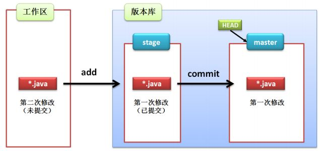

@[git笔记](这里写自定义目录标题)

# 前言

## 版本控制

&emsp;&emsp;数据是短暂的，且容易丢失。特别是作为开发人员的我们，需要频繁的对项目代码进行更新，容易产生错误的变更或者是项目文件的丢失。因此，我们需要在整个工作的过程中不断的备份和存档我们的项目文件。
 
&emsp;&emsp;在当下的项目开发环境下，一个项目往往是有多个开发者共同开发维护的，那么意味着他们需要操作同一项目文件，我们需要对文本和项目代码的变更进行记录管理，这些变更就构成了一个版本库，对版本库的管理就是版本控制。
 
&emsp;&emsp;一个可以管理或追踪软件代码的工具通常称为版本控制系统（VCS）。现在流行的版本控制工具很多，当然，我们接下来要说的就是称的上VCS界一哥的Git，它是一款功能强大、灵活且低开销的VCS，它可以让协同开发成为一种乐趣。

## Git的诞生
&emsp;&emsp;其实，在Git诞生之前市面上已经有非常多的VCS了，比如当时VCS界的老大哥：SVN（现在在市面上也还有不小的份额）。那为什么还要创造Git这个新工具呢？
 
&emsp;&emsp;这当然得从他的创始人Linus Torvalds说起 ，一个在技术界被千万人顶礼膜拜的男人！为了方便管理Linux内核的开发工作，一个可靠的值得信赖的VCS是不可或缺的，但是，Linus一直痛恨的CVS及SVN都是集中式的版本控制系统，而Git是分布式版本控制系统，集中式和分布式版本控制系统有什么区别呢？

## 集中式vs分布式

&emsp;&emsp;先说集中式版本控制系统，版本库是集中存放在中央服务器的，而干活的时候，用的都是自己的电脑，所以要先从中央服务器取得最新的版本，然后开始干活，干完活了，再把自己的活推送给中央服务器。中央服务器就好比是一个图书馆，你要改一本书，必须先从图书馆借出来，然后回到家自己改，改完了，再放回图书馆。
 
&emsp;&emsp;集中式版本控制系统最大的毛病就是必须联网才能工作，如果在局域网内还好，带宽够大，速度够快，可如果在互联网上，遇到网速慢的话，可能提交一个10M的文件就需要5分钟，这还不得把人给憋死啊。
 
&emsp;&emsp;那分布式版本控制系统与集中式版本控制系统有何不同呢？首先，分布式版本控制系统根本没有“中央服务器”，每个人的电脑上都是一个完整的版本库，这样，你工作的时候，就不需要联网了，因为版本库就在你自己的电脑上。既然每个人电脑上都有一个完整的版本库，那多个人如何协作呢？比方说你在自己电脑上改了文件A，你的同事也在他的电脑上改了文件A，这时，你们俩之间只需把各自的修改推送给对方，就可以互相看到对方的修改了。
 
&emsp;&emsp;和集中式版本控制系统相比，分布式版本控制系统的安全性要高很多，因为每个人电脑里都有完整的版本库，某一个人的电脑坏掉了不要紧，随便从其他人那里复制一个就可以了。而集中式版本控制系统的中央服务器要是出了问题，所有人都没法干活了。

## git的正确打开方式 
要使用Git，第一步当然是安装Git了。

1. 在Linux上安装Git

2. 在Windows上安装Git

3. 在Windows上安装Git

# 正文
## Git工作流程

先上图: 
以上包括一些简单而常用的命令，但是先不关心这些，先来了解下面这4个专有名词。
- Workapace : 工作区
- Index/Stage ：暂存区
- Repository ：仓库区（或本地仓库）
- Remote ：远程仓库

### 工作区（Workapace）
&emsp;&emsp;程序员开发改动的地方，是你当前看到的，也是最新的。
 
&emsp;&emsp;平时开发就是拷贝远程仓库中的一个分支，并基于该分支进行开发。在开发的过程中就是对工作区的操作。
### 暂存区（Index/Stage）
&emsp;&emsp;.git目录下的index文件，暂存区会记录 `git add` 添加的文件的相关信息（文件名、大小...）,不保存文件实体。可以使用`git status`查看暂存区的状态。暂存区标记了你当前工作区中，哪些内容是被Git管理的。
 
&emsp;&emsp;当你完成某个功能需要提交到远程仓库中，那么第一步就是要将更改通过`git add`提交到暂存区，被Git管理。
### 本地仓库（Repository）
&emsp;&emsp;.保存了对象被提交过的各个版本，比起工作区和暂存区的内容，它更旧一些。
 
&emsp;&emsp;`git commit`后同步index的目录树到本地仓库，方便从下一步通过`git push`同步本地仓库与远程仓库。
### 远程仓库（Remote）
&emsp;&emsp;远程仓库的内容可能被分布在多个地点的处于协作关系的本地仓库修改，因此它可能与本地仓库同步，也可能不同步。我们在提交之前需要`git pull`使本地仓库拉下代码。
### HEAD
&emsp;&emsp;在掌握具体命令前，先理解下HEAD。
 
&emsp;&emsp;HEAD，它始终指向当前所处分支的最新的提交点。你所处的分支变化了，或者产生了新的提交点，HEAD就会跟着改变。
 
无图无真相
### 小结
1. 任何对象都是在工作区诞生和被修改；
2. 任何修改都是从进入index区才开始被版本控制；
3. 只有把修改提交到本地仓库，该修改才能在仓库留下足迹；
4. 与协作者分享本地的更改，需要将更改push到远程仓库

## 常用的Git命令

继续上图

### 一、新建代码库

- 在当前新目录新建一个git代码库
> $ git init

- 新建一个目录，将其初始化为First代码库
> $ git init [project-name]

- 下载一个项目和它的整个代码史
>  $ git clone [url]

### 二、配置

Git的设置文件为.gitconfig，它可以在用户主目录下（全局配置），也可以在项目目录下（项目配置）

1. 显示当前的Git配置
> $git config --list

2. 编辑Git配置文件
> $ git config -e [--global]
 
3. 设置提交代码时的用户信息
> $ git config [--global] user.name "[name]"

> $ git config [--global] user.email "[email address]"

### 三、增加/删除文件

- 添加指定文件到暂存区
> $ git add [file1] [file2] ...

- 添加指定目录到暂存区
> $ git add [dir]

- 添加所有文件到暂存区
> $  git add .

- 添加每个变化前，都会要求确认，对于同一个文件的多处变化，可以实现分次提交
> $ git add -p 

- 删除工作区文件，并且将这次删除彷如暂存区
> $ git rm [file1] [file2] ...

- 停止追踪指定文件，但该文件会保留在工作区
>$  git rm -cached [file]

- 改名文件，并且将这个改名放入暂存区
> $ git mv [file-origin] [file-rename]

### 四、代码提交

- 提交暂存区到仓库区 
>$ git connit -m [message] 

- 提交暂存区的指定文件到仓库区
> $ git commit [file1] [file2] ... -m [message] 

- 提交工作区自上次commit之后的变化，直接到仓库区
> $ git commit -a 

- 提交时显示所有的diff信息
> $ git commit -v 

- 使用一次新的commit，替代上一次提交，如果代码没有任何变化，则用来改写上一次commit的提交信息
> $ git commit --amend -m [message]

- 重做上一次commit，并包括指定文件的新变化
> $ git commit -amend [file1] [file2]...

### 五、分支

- 列出所有本地分支
>  $git branch

- 列出所有远程分支
> git branch -r 
 
- 列出所有本地分支和远程分支
>  $ git branch -a

- 新建一个分支，但依然停留在当前分支
>  $ git branch [branch-name] 

- 新建一个分支，并切换到该分支
>  $ git branch -b [branch-name] 

- 新建一个分支，指向指定的commit
> $ git branch [branch] [commit]

- 新建一个分支，与指定远程分支建立追踪关系
> $ git branch --track [branch] [remote-branch]

- 切换到指定分支，并更新工作区
>  $ git checkout [branch-name] 

- 切换到上一分支
>  $ git checkout - 

- 建立追踪关系，在现有分支和指定的远程分支之间
> $ git branch --set-up-tream [branch] [remote-branch]

- 合并指定分支到当前分支
> $ git merge [branch] 

- 选择一个commit，合并进当前分支
> $ git cherry-pick [commit]

- 删除分支
>  $ git branch -d [branch-name] 
 
 - 删除远程分支
 > $ git push prigin --delete [branch-name]

> $ git branch -dr [remote/branch]

### 六、标签

- 列出所有tag
> $ git tag

- 新建一个tag在当前commit
> $ git tag [tag]

- 新建一个tag在指定commit
> $ git tag [tag] [commit]

- 删除本地tag
> $ git tag -d [tag]

- 删除远程tag
> $ git push origin :refs/tags/[tagName]

- 查看tag信息
> git push [remote] --tags

- 