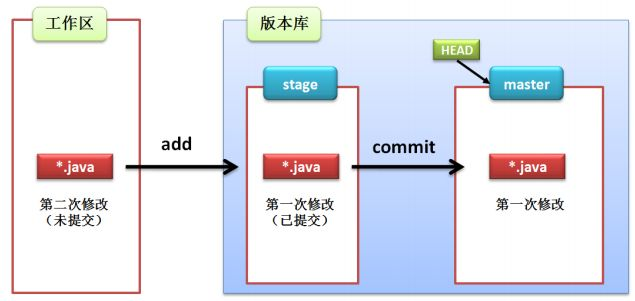

@[git笔记](这里写自定义目录标题)

# 前言

## 版本控制

&emsp;&emsp;数据是短暂的，且容易丢失。特别是作为开发人员的我们，需要频繁的对项目代码进行更新，容易产生错误的变更或者是项目文件的丢失。因此，我们需要在整个工作的过程中不断的备份和存档我们的项目文件。
 
&emsp;&emsp;在当下的项目开发环境下，一个项目往往是有多个开发者共同开发维护的，那么意味着他们需要操作同一项目文件，我们需要对文本和项目代码的变更进行记录管理，这些变更就构成了一个版本库，对版本库的管理就是版本控制。
 
&emsp;&emsp;一个可以管理或追踪软件代码的工具通常称为版本控制系统（VCS）。现在流行的版本控制工具很多，当然，我们接下来要说的就是称的上VCS界一哥的Git，它是一款功能强大、灵活且低开销的VCS，它可以让协同开发成为一种乐趣。

## Git的诞生
&emsp;&emsp;其实，在Git诞生之前市面上已经有非常多的VCS了，比如当时VCS界的老大哥：SVN（现在在市面上也还有不小的份额）。那为什么还要创造Git这个新工具呢？
 
&emsp;&emsp;这当然得从他的创始人Linus Torvalds说起 ，一个在技术界被千万人顶礼膜拜的男人！为了方便管理Linux内核的开发工作，一个可靠的值得信赖的VCS是不可或缺的，但是，Linus一直痛恨的CVS及SVN都是集中式的版本控制系统，而Git是分布式版本控制系统，集中式和分布式版本控制系统有什么区别呢？

## 集中式vs分布式

&emsp;&emsp;先说集中式版本控制系统，版本库是集中存放在中央服务器的，而干活的时候，用的都是自己的电脑，所以要先从中央服务器取得最新的版本，然后开始干活，干完活了，再把自己的活推送给中央服务器。中央服务器就好比是一个图书馆，你要改一本书，必须先从图书馆借出来，然后回到家自己改，改完了，再放回图书馆。
 
&emsp;&emsp;集中式版本控制系统最大的毛病就是必须联网才能工作，如果在局域网内还好，带宽够大，速度够快，可如果在互联网上，遇到网速慢的话，可能提交一个10M的文件就需要5分钟，这还不得把人给憋死啊。
 
&emsp;&emsp;那分布式版本控制系统与集中式版本控制系统有何不同呢？首先，分布式版本控制系统根本没有“中央服务器”，每个人的电脑上都是一个完整的版本库，这样，你工作的时候，就不需要联网了，因为版本库就在你自己的电脑上。既然每个人电脑上都有一个完整的版本库，那多个人如何协作呢？比方说你在自己电脑上改了文件A，你的同事也在他的电脑上改了文件A，这时，你们俩之间只需把各自的修改推送给对方，就可以互相看到对方的修改了。
 
&emsp;&emsp;和集中式版本控制系统相比，分布式版本控制系统的安全性要高很多，因为每个人电脑里都有完整的版本库，某一个人的电脑坏掉了不要紧，随便从其他人那里复制一个就可以了。而集中式版本控制系统的中央服务器要是出了问题，所有人都没法干活了。

## git的正确打开方式 
要使用Git，第一步当然是安装Git了。
* 在Linux上安装Git
* 在Windows上安装Git
* 在Windows上安装Git

详细信息请移步[廖雪峰的官方网站](https://www.liaoxuefeng.com/wiki/0013739516305929606dd18361248578c67b8067c8c017b000/00137396287703354d8c6c01c904c7d9ff056ae23da865a000)

# 正文
## Git工作流程

先上图: 
以上包括一些简单而常用的命令，但是先不关心这些，先来了解下面这4个专有名词。
- Workapace : 工作区
- Index/Stage ：暂存区
- Repository ：仓库区（或本地仓库）
- Remote ：远程仓库

### 工作区（Workapace）
&emsp;&emsp;程序员开发改动的地方，是你当前看到的，也是最新的。
 
&emsp;&emsp;平时开发就是拷贝远程仓库中的一个分支，并基于该分支进行开发。在开发的过程中就是对工作区的操作。
### 暂存区（Index/Stage）
&emsp;&emsp;.git目录下的index文件，暂存区会记录 `git add` 添加的文件的相关信息（文件名、大小...）,不保存文件实体。可以使用`git status`查看暂存区的状态。暂存区标记了你当前工作区中，哪些内容是被Git管理的。
 
&emsp;&emsp;当你完成某个功能需要提交到远程仓库中，那么第一步就是要将更改通过`git add`提交到暂存区，被Git管理。
### 本地仓库（Repository）
&emsp;&emsp;.保存了对象被提交过的各个版本，比起工作区和暂存区的内容，它更旧一些。
 
&emsp;&emsp;`git commit`后同步index的目录树到本地仓库，方便从下一步通过`git push`同步本地仓库与远程仓库。
### 远程仓库（Remote）
&emsp;&emsp;远程仓库的内容可能被分布在多个地点的处于协作关系的本地仓库修改，因此它可能与本地仓库同步，也可能不同步。我们在提交之前需要`git pull`使本地仓库拉下代码。
### HEAD
&emsp;&emsp;在掌握具体命令前，先理解下HEAD。
 
&emsp;&emsp;HEAD，它始终指向当前所处分支的最新的提交点。你所处的分支变化了，或者产生了新的提交点，HEAD就会跟着改变。
 
无图无真相
### 小结
1. 任何对象都是在工作区诞生和被修改；
2. 任何修改都是从进入index区才开始被版本控制；
3. 只有把修改提交到本地仓库，该修改才能在仓库留下足迹；
4. 与协作者分享本地的更改，需要将更改push到远程仓库

## 常用的Git命令

继续上图

### 一、新建代码库

- 在当前新目录新建一个git代码库
> $ git init

- 新建一个目录，将其初始化为First代码库
> $ git init [project-name]

- 下载一个项目和它的整个代码史
>  $ git clone [url]

### 二、配置

Git的设置文件为.gitconfig，它可以在用户主目录下（全局配置），也可以在项目目录下（项目配置）

1. 显示当前的Git配置
> $git config --list

2. 编辑Git配置文件
> $ git config -e [--global]
 
3. 设置提交代码时的用户信息
> $ git config [--global] user.name "[name]"

> $ git config [--global] user.email "[email address]"

### 三、增加/删除文件

- 添加指定文件到暂存区
> $ git add [file1] [file2] ...

- 添加指定目录到暂存区
> $ git add [dir]

- 添加所有文件到暂存区
> $  git add .

- 添加每个变化前，都会要求确认，对于同一个文件的多处变化，可以实现分次提交
> $ git add -p 

- 删除工作区文件，并且将这次删除彷如暂存区
> $ git rm [file1] [file2] ...

- 停止追踪指定文件，但该文件会保留在工作区
>$  git rm -cached [file]

- 改名文件，并且将这个改名放入暂存区
> $ git mv [file-origin] [file-rename]

### 四、代码提交

- 提交暂存区到仓库区 
>$ git connit -m [message] 

- 提交暂存区的指定文件到仓库区
> $ git commit [file1] [file2] ... -m [message] 

- 提交工作区自上次commit之后的变化，直接到仓库区
> $ git commit -a 

- 提交时显示所有的diff信息
> $ git commit -v 

- 使用一次新的commit，替代上一次提交，如果代码没有任何变化，则用来改写上一次commit的提交信息
> $ git commit --amend -m [message]

- 重做上一次commit，并包括指定文件的新变化
> $ git commit -amend [file1] [file2]...

### 五、分支

- 列出所有本地分支
>  $git branch

- 列出所有远程分支
> git branch -r 
 
- 列出所有本地分支和远程分支
>  $ git branch -a

- 新建一个分支，但依然停留在当前分支
>  $ git branch [branch-name] 

- 新建一个分支，并切换到该分支
>  $ git branch -b [branch-name] 

- 新建一个分支，指向指定的commit
> $ git branch [branch] [commit]

- 新建一个分支，与指定远程分支建立追踪关系
> $ git branch --track [branch] [remote-branch]

- 切换到指定分支，并更新工作区
>  $ git checkout [branch-name] 

- 切换到上一分支
>  $ git checkout - 

- 建立追踪关系，在现有分支和指定的远程分支之间
> $ git branch --set-up-tream [branch] [remote-branch]

- 合并指定分支到当前分支
> $ git merge [branch] 

- 选择一个commit，合并进当前分支
> $ git cherry-pick [commit]

- 删除分支
>  $ git branch -d [branch-name] 
 
 - 删除远程分支
 > $ git push prigin --delete [branch-name]

> $ git branch -dr [remote/branch]

### 六、标签

- 列出所有tag
> $ git tag

- 新建一个tag在当前commit
> $ git tag [tag]

- 新建一个tag在指定commit
> $ git tag [tag] [commit]

- 删除本地tag
> $ git tag -d [tag]

- 删除远程tag
> $ git push origin :refs/tags/[tagName]

- 查看tag信息
> $ git show [tag]

- +提交指定tag
>  $ git push [remote] [tag]

- 提交所有tag
> $ git push [remote] --tages

- 新建一个分支，指向某个teg
> $ git checkout -b [branch] [tag]

### 七、查看信息

- 显示有变更的文件
> $ git status

- 显示当前分支的版本历史
> $ git long

- 显示某个commit历史，以及每次commit发生变更的文件
> $ git log [tag] HEAD --grep feature

- 显示某个commit之后的所有变动，其“提交说明”必须符合搜索条件
> $ git log [tag] HEAD --grop feature

- 显示某个文件的版本历史，包括文件改名
> $ git log --follow [file] 

> $ git whatchanged [file]

- 显示过去5次的提交
> $ git log -5 --prettty --online

- 显示所有提交过的用户，按提交次数排序
> $ git shortlog -sn

- 显示指定文件是什么人在什么时间修改过
> $ git blame [file]

- 显示暂存区和工作区的代码差异
>  $ git diff 

- 显示暂存区和上一个commit的差异
> $ git diff -cached [file]

- 显示工作区与当前分支最新commit之间的差异
> $ git diff HEAD

- 显示两次提交之间的差异
> $ git diff [first-btanch]...[second-branch]

- 显示某次提交的元素数据和内容变化
> $ git show [commit]

- 显示某次提交时，某个文件的内容
> $ git show [commit]:[filename]

- 显示当前分支的最近几次提交
> $ git reflog

- 从本地master拉取代码更新当前分支：branch一般为master
> $ git rebase [branch] 

### 八、远程分支

- 更新远程仓储
>  $ git remote update 

- 显示所有远程仓库
> $ git remote -v

- 显示某个远程仓库信息
> $ git remote show [remote]

- 增加一个新的远程仓库，并命名
> $ git remote add [shortname] [url]

- 取回远程仓库的变化，并与本地分支合并
> $ git push [remote] [branch]

- 上传本地分支到远程仓库
> $ git push [remote] [branch]

- 强行推送当前分支到远程仓库
> $ git push [remote] --force

- 推送所有分支到远程仓库
> git push [remote] --all

### 九、撤销

- 恢复暂存区的指定文件到工作区
> $ git checkout [commit] [file]

- 恢复某个commit的指定文件到暂存区和工作区
> $ git chechout .

- 重置暂存区的指定文件，与上一次commit保持一致，但工作区不变
> $ git reset [file]

- 重置暂存区和工作区，与上次commit保持一致
> $ git reset --hard

- 重置当前分支的指针为指定commit，同时是重置暂存区，但工作区不变
> $ git reset [commit]

- 重置当前分支的HEAD为指定commit，同时重置暂存区与工作区，与指定commit保持一致
> $git reset --hard [commit]

- 重置当前HEAD为指定commit，但保持暂存区和工作区不变
> $ git reset --keep [commit]

- 新建一个commit，哦用来撤销指定commit，后者的变化都被前者抵消，并且应用到当前分支
> $ git revert [commit]

- 暂时将未提交的变化移除，稍后再移入
> $ git stash
> $ git stash pop

### 十、其他

- 生成一个可供发布的压缩包
> $ git archive

## GitHub

### 什么是GitHub

&emsp;&emsp;github是一个基于git的代码托管平台，付费用户可以建私人仓库，我们一般的免费用户只能使用公共仓库，也就是代码要公开。
 
&emsp;&emsp;Git本身完全可以做到版本控制，但其所有内容以及版本记录只能保存在本机，如果想要将文件内容以及版本记录同时保存在远程，则需要结合GitHub来使用。使用场景：
* 无GitHub：在本地 .git 文件夹内维护历时文件
* 有GitHub：在本地 .git 文件夹内维护历时文件，同时也将历时文件托管在远程仓库

推荐一个风趣易懂的Git介绍，戳这里：[如何使用 GitHub？](https://www.zhihu.com/question/20070065/answer/79557687)

### 我们能用GitHub做什么

&emsp;&emsp;我们一直用GitHub作为免费的远程仓库，如果是个人的开源项目，放到GitHub上是完全没有问题的。其实GitHub还是一个开源协作社区，通过GitHub，既可以让别人参与你的开源项目，也可以参与别人的开源项目。
 
&emsp;&emsp;在GitHub出现以前，开源项目开源容易，但让广大人民群众参与进来比较困难，因为要参与，就要提交代码，而给每个想提交代码的群众都开一个账号那是不现实的，因此，群众也仅限于报个bug，即使能改掉bug，也只能把diff文件用邮件发过去，很不方便。
 
&emsp;&emsp;但是在GitHub上，利用Git极其强大的克隆和分支功能，广大人民群众真正可以第一次自由参与各种开源项目了。
 
&emsp;&emsp;如何参与一个开源项目呢？
 
&emsp;&emsp;比如人气极高的bootstrap项目，这是一个非常强大的CSS框架，你可以访问它的项目主页`https://github.com/twbs/bootstrap`，点“Fork”就在自己的账号下克隆了一个bootstrap仓库，然后，从自己的账号下clone：

> clone git@github.com:michaelliao/bootstrap.git

&emsp;&emsp;一定要从自己的账号下clone仓库，这样你才能推送修改。如果从bootstrap的作者的仓`it@github.com:twbs/bootstrap.git`克隆，因为没有权限，你将不能推送修改。

* 如果你想修复bootstrap的一个bug，或者新增一个功能，立刻就可以开始干活，干完后，往自己的仓库推送。
* 如果你希望bootstrap的官方库能接受你的修改，你就可以在GitHub上发起一个pull request。当然，对方是否接受你的pull request就不一定了。

* 如果你没能力修改bootstrap，但又想要试一把pull request，那就Fork一下廖雪峰老师的仓库`https://github.com/michaelliao/learngit`，创建一个your-github-id.txt的文本文件，写点自己学习Git的心得，然后推送一个pull request给我，我会视心情而定是否接受。

### 小结
* 在GitHub上，可以任意Fork开源仓库；

* 自己拥有Fork后的仓库的读写权限；

* 可以推送pull request给官方仓库来贡献代码。

# 总结 
&emsp;&emsp;路漫漫其修远兮，希望Git及GitHub可以帮我们记录每一个脚印，每一步成长。与诸君共勉。